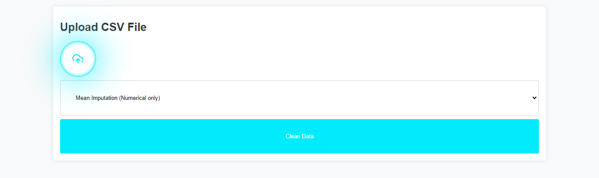
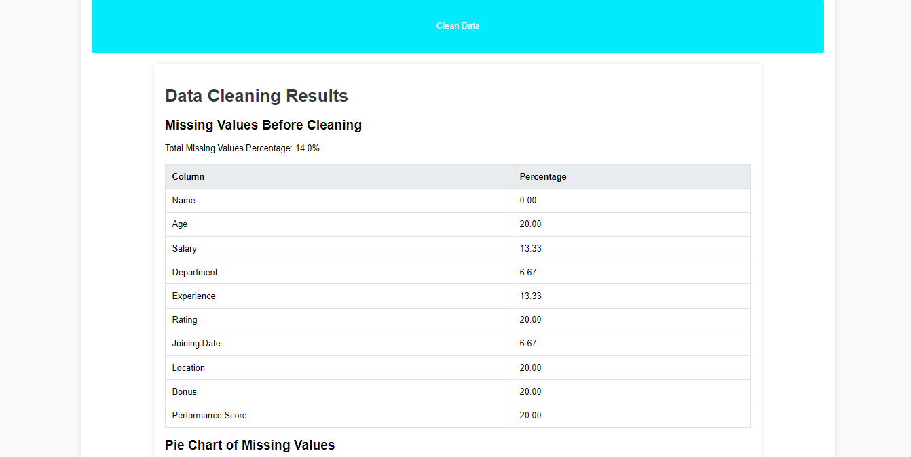
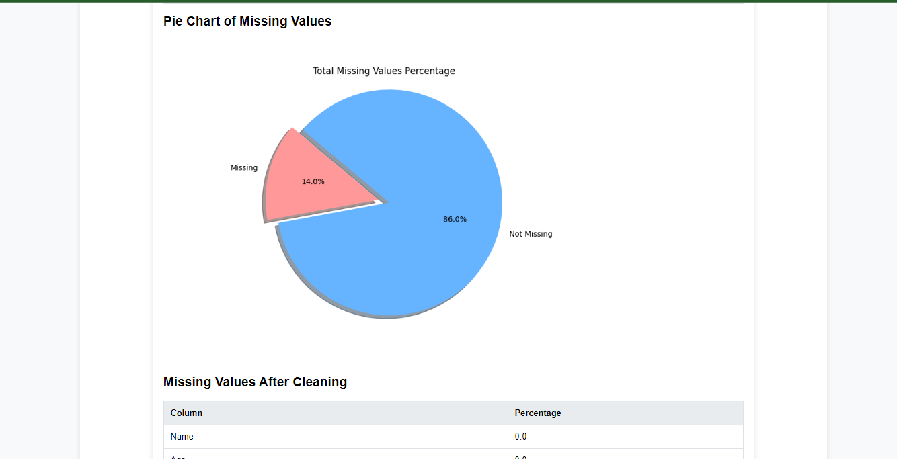
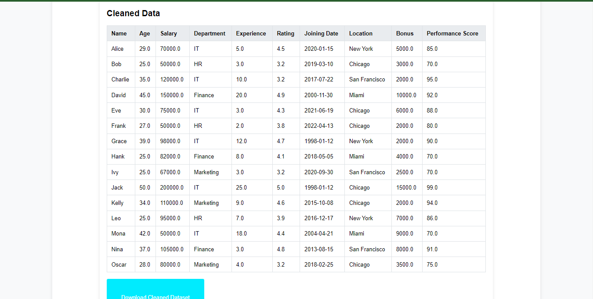

# Data Cleaning Web Application

## Overview

This web application allows users to upload a dataset (CSV file), clean the data by handling missing values using various methods, and download the cleaned dataset. It also provides visual statistics of the missing values before cleaning, including a pie chart.

## Features

- Upload a dataset (CSV file).
- Choose from multiple methods to handle missing values: Mean, Median, Mode, KNN, or Iterative.
- View statistics of missing values before and after cleaning.
- Download the cleaned dataset.
- Visualize the percentage of missing values with a pie chart.

## Technologies Used

- **Languages:** Python, HTML, CSS
- **Frameworks:** Flask,HTMX(AJAX)
- **Libraries:** pandas, scikit-learn, matplotlib

## Installation

1. Clone the repository:
    ```bash
    git clone https://github.com/ZaynZain/Csv-DataCleaner.git
    cd data-cleaning-web-app
    ```

2. Create a virtual environment and activate it:
    ```bash
    python3 -m venv venv
    source venv/bin/activate  # On Windows use `venv\Scripts\activate`
    ```

3. Install the required packages:
    ```bash
    pip install -r requirements.txt
    ```

4. Run the application:
    ```bash
    python main.py
    ```

5. Open your web browser and navigate to `http://127.0.0.1:5000`.

## Usage

1. **Upload Dataset:**
    - Click on the "Choose File" button to upload your CSV file.

2. **Select Cleaning Method:**
    - Choose the method you want to use for handling missing values from the dropdown menu:
      - Mean
      - Median
      - Mode
      - KNN
      - Iterative

3. **Submit:**
    - Click on the "Submit" button to process the dataset.

4. **View Results:**
    - View the missing values statistics before and after cleaning.
    - See the pie chart of the total missing values percentage.

5. **Download Cleaned Dataset:**
    - Click on the "Download Cleaned Dataset" button to download the cleaned CSV file.

## Screenshots

### Upload Section



### Data Before Clean Section(result.html)



### Pie Chart Section(result.html)



### Cleaned Data Section



## Project Structure
data-cleaning-web-app/
│
├── static/
│ ├── files/
│ │ └── cleaned_dataset.csv
│ │ └── missing_values_pie_chart.png
│ ├── images/
│ │ └── home_page.png
│ │ └── results_page.png
│ ├── styles/
│ │ └── index.css
│ │ └── results.css
│
├── templates/
│ ├── index.html
│ └── results.html
│
├── app.py
├── requirements.txt
└── README.md


## License

This project is licensed under the MIT License. See the [LICENSE](LICENSE) file for details.

## Contact

For any inquiries, please contact [zayn69zain@gmail.com](mailto:zayn69zain@gmail.com).


